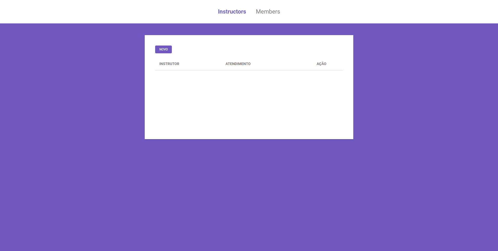
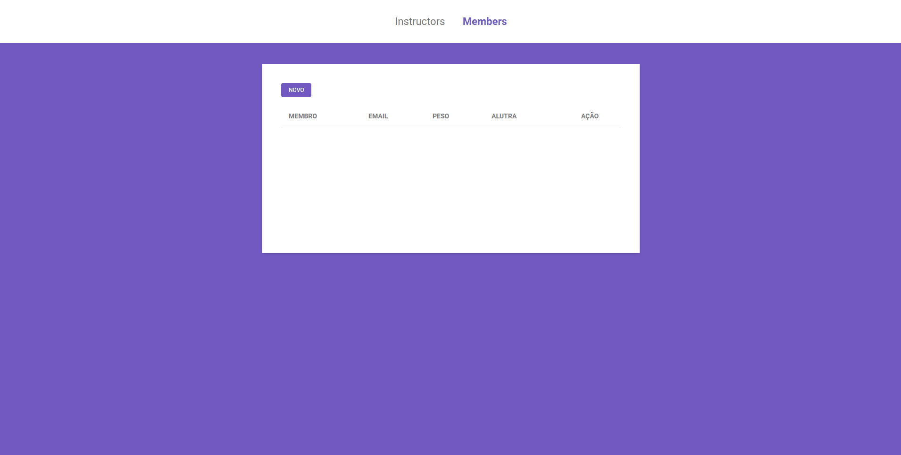

# Gym Academy

<h1 align="center">
  
</h1>
<h1 align="center">
  
</h1>

 

## 📃 Sobre

Projeto Gym academy desenvolvido no curso Launchbase da Rocketseat.

 

## 💼 Principais Tecnologias Utilizadas

- Html
- Css
- JavaScript
- NodeJs
- Express
- Nunjucks

 

Desenvolvido por Vínicius Wilbert Hack 🖤
